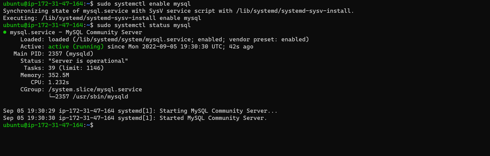
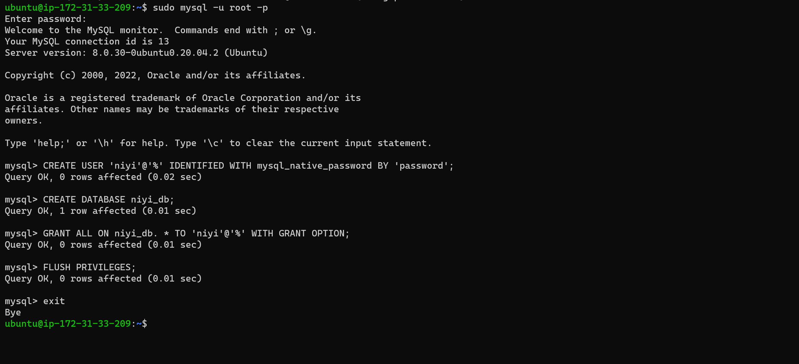
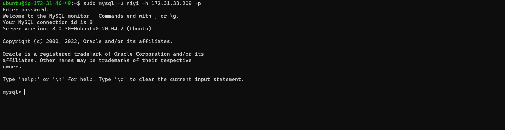
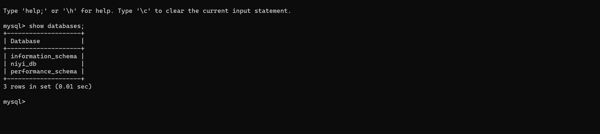

# Project-5

For Project 5

# Documentation for Mysql Server-Client Architecture

Create two instances of Ubuntu Server the AWS EC2 and name one DB-server and the other client

## Installation of MYSQL Server on the DB-server 

`sudo apt update`

`sudo apt install mysql-server`

`sudo systemctl enable mysql`

`sudo systemctl status mysql`

`sudo mysql`

`ALTER USER 'root'@'localhost' IDENTIFIED WITH mysql_native_password BY 'password';`

`exit`

Then you do the Mysql secure installation

`sudo mysql_secure_installation`

### Create a User and database on the MYSQL Server

`sudo mysql`

`CREATE USER 'niyi'@'%' IDENTIFIED WITH mysql_native_password BY 'password';`

`CREATE DATABASE niyi-db;`

`GRANT ALL ON niyi-db. * TO 'niyi'@'%' WITH GRANT OPTION;`

`FLUSH PRIVILEGES;`

`exit`

## Installation of MYSQL Client on the Client  

Connect to the Client Server

`sudo apt update`

`sudo apt install mysql-client`

## Configuring the MYsql-Server for remote connection on the DB-Server

`sudo vi /etc/mysql/mysql.con.d/mysqld.cnf`

Change the bind-address in the file from 127.0.0.1 to 0.0.0.0 to allow connection from all ip address

Then restart the mysql server to all the new config to start running

`sudo systemctl restart mysql`

## Connection to the Mysql Server from the Mysql client using Mysql utility on Client

`sudo mysql -u niyi -h 172.31.33.209 -p`

type in the password

`show databases`

